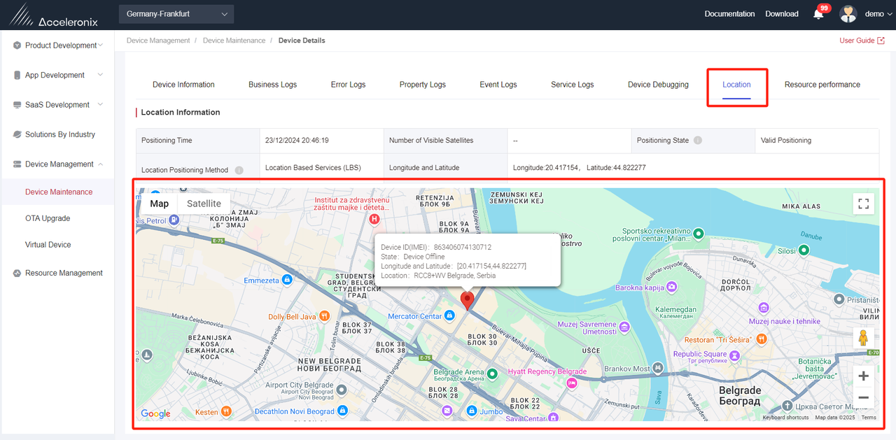
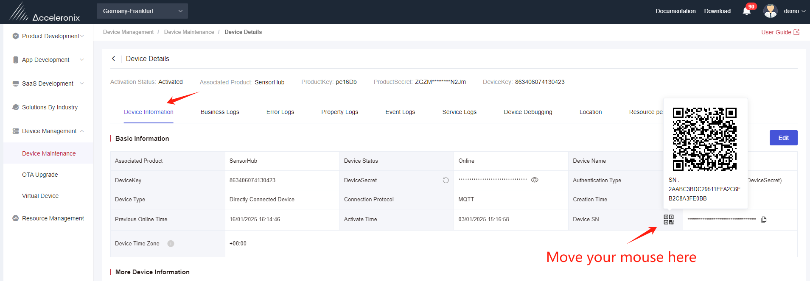
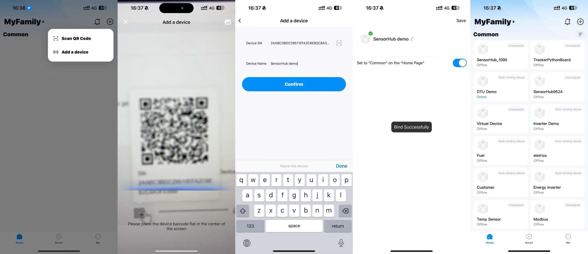
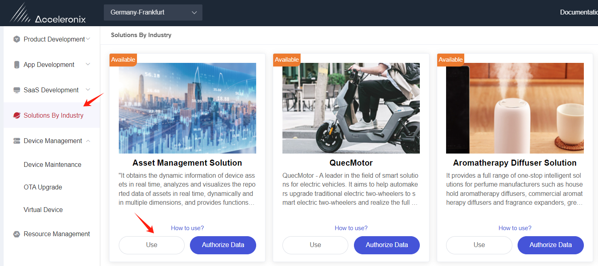
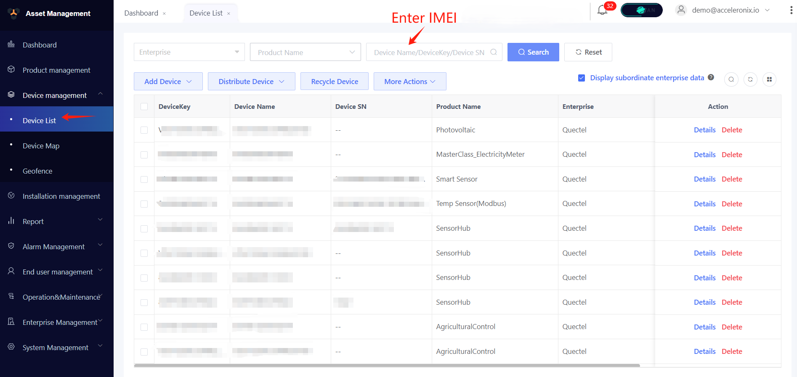

# SIMPLI Kit Python Sample

This repository contains Python sample code for working with Acceleronix SIMPLI-Kit hardware, providing a complete solution for IoT sensor data collection and cloud connectivity.

## Project Structure

The project is organized into the following components:

- **Main Application:** Entry point that initializes all services
- **Drivers:** Hardware interfaces for various sensors (SHTC3, LPS22HB, TCS34725, ICM20948)
- **Extensions:** Services for GNSS, LBS, sensors, and Acceleronix cloud connectivity
- **Libraries:** Utility modules for I2C communication, threading, logging, etc.

## Configuration
Please update the `config.json` file with your product credentials created in [Acceleronix IoT Developer Center](https://core.acceleronix.io/).
   ```json
   {
       "QTH_PRODUCT_KEY": "your_product_key",
       "QTH_PRODUCT_SECRET": "your_product_secret",
       "QTH_SERVER": "mqtt://your-server-address:1883"
   }
   ```
## Hardware Components

### Supported Sensors
| Sensor | Description | Capabilities |
|--------|-------------|--------------|
| SHTC3 | Temperature & humidity sensor | High-accuracy environmental monitoring |
| LPS22HB | Barometric pressure sensor | Pressure and temperature readings |
| TCS34725 | RGB color sensor | Color detection and light sensing |
| ICM20948 | 9-axis motion sensor | Accelerometer, gyroscope, and magnetometer |


### Services
- **GNSS Service:** GPS location tracking and position reporting
- **LBS Service:** Location approximation using cellular tower information
- **Sensor Service:** Collection and aggregation of sensor data
- **Qth Client:** Cloud connectivity and data transmission

## Getting Started

### Hardware Setup

1. **Power the Device**
   - Connect the SIMPLI-Kit using a Type-C cable to your laptop or power bank
   - The device will automatically connect to the internet using the built-in vSIM

### Platform Access

1. **Login to Developer Center**
   - URL: [Acceleronix Developer Center](https://core.acceleronix.io/login)
   - Demo Account:
     - Username: `userdemo@1293621240625108.acceleronix.io`
     - Password: `evk@123456`

2. **Locate Your Device**
   - Navigate to **Device Management** → **Device Maintenance** → **Device List**
   - Search using the IMEI code (found on the white sticker on your device)


3. **Access Device Details**
   - Click **View** to see the device dashboard
   - Explore the device information tab for complete specifications

   

4. **Check Location Data**
   - Click on the **Location** tab to view your device's position
   - The device uses LBS (cell tower) data for location approximation

   > **Note:** LBS location accuracy can vary from several hundred meters to several kilometers depending on cell tower density, signal strength, and other environmental factors.

   

### Mobile Application Integration

1. **Generate Device QR Code**
   - Navigate to the Device Information page
   - Hover over the QR code icon to display the device pairing code

   

2. **Install Wonderfree App**
   - [Wonderfree App Information](https://www.acceleronix.io/products/app)
   - [iOS App Store](https://apps.apple.com/gb/app/wonderfree/id6450249586)
   - [Google Play Store](https://play.google.com/store/search?q=wonderfree&c=apps&hl=en_CA&gl=US)

   > **Note:** Please use your personal email address to register a new Wonderfree account.

3. **Add Your Device**
   - Open the Wonderfree app and log in
   - Tap "Add device" and scan the QR code from step 1

   

4. **Monitor Sensor Data**
   - Your device will appear on the home screen when online
   - Tap the device to view the control panel with real-time sensor data

   

### Enterprise Solution Access

1. **Access Asset Management SaaS**
   - Navigate to **Solutions By Industry** → **Asset Management Solution**
   - Click **Use** to open the SaaS application

   

2. **Manage Your Devices**
   - Go to **Device Management** → **Device List**
   - Search for your Python EVB Kit using its IMEI code

   

## Developer Resources

For additional technical details, documentation, and advanced usage examples, visit the [Acceleronix Developer Portal](https://core.acceleronix.io/).

## Support

If you encounter any issues or have questions about this sample code, please contact [Acceleronix Support](mailto:support@acceleronix.io).